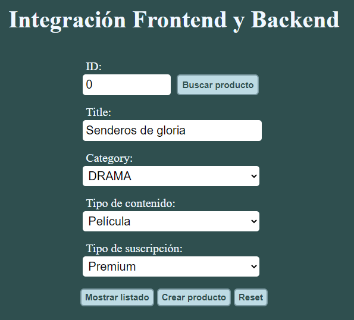
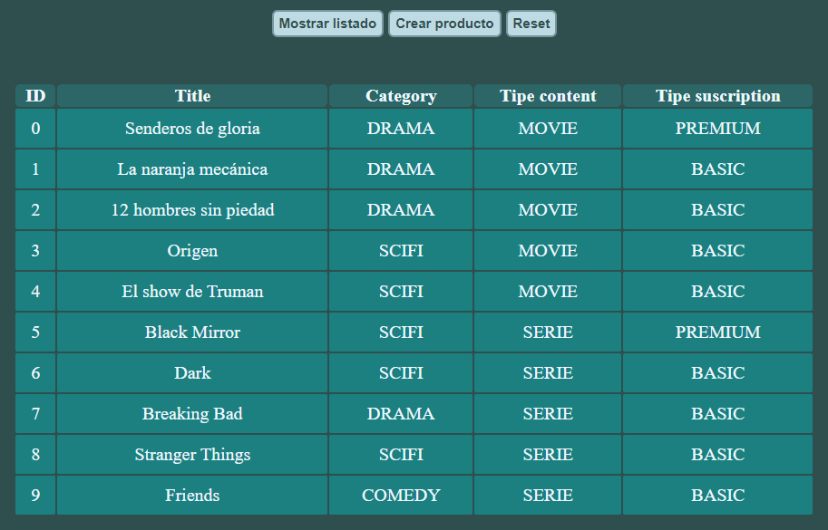
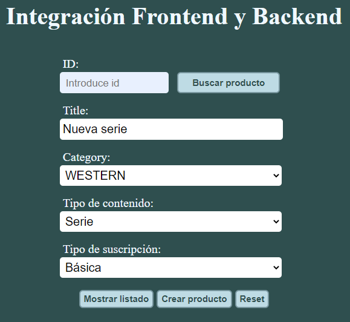
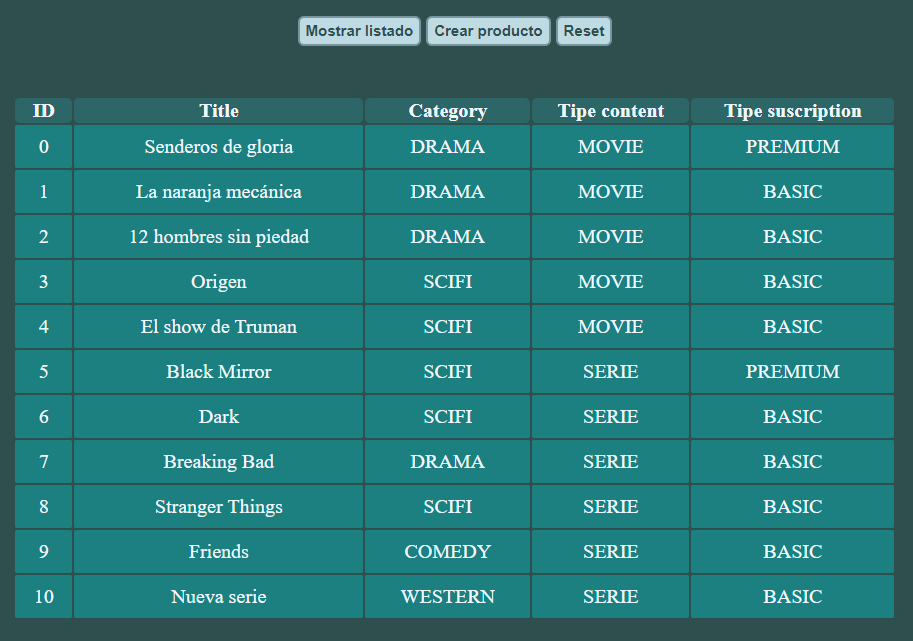

# Integración Frontend y Backend

## Introducción

El objetivo del proyecto es trabajar sobre un sistema de contenido en streaming, como Netflix.

En el apartado de funciones disponibles se indican las distintas posibilidades del proyecto.

## Requisitos

* Tener instalado [Spring Tool Suite](https://spring.io/tools), para la parte backend.
* Utilizar algún navegador web (preferiblemente [Google Chrome](https://www.google.com/intl/es_es/chrome/)), para la parte frontend.

## Preparación del entorno

Para utilizar la aplicación web, primero debemos descargar los entornos backend y frontend.

### Backend
* Descargamos el [proyecto backend](https://github.com/raulmoralesruiz/DWES_nextflix) desde aquí: https://github.com/raulmoralesruiz/DWES_nextflix

* Importamos el proyecto en Spring.
    
        File -> Import -> Maven -> Existing Maveng Projects
        Seleccionamos la carpeta "DWES_nextflix" como raíz.

        Una vez agregado el proyecto, Spring descargará las dependencias necesarias (podemos comprobarlo en la esquina inferior derecha.)

* Iniciamos el servidor desde Spring

        Tras importar el proyecto, iniciamos el servidor desde el apartado "Boot Dashboard" (normalmente ubicado en la parte inferior izquieda.)

        Desplegamos el botón "local" -> click botón derecho sobre "DWES_nextflix" -> click sobre start

### Frontend
* Descargamos el [proyecto frontend](https://github.com/raulmoralesruiz/DWEC/tree/master/JS/proyectos/public/integracion) desde aquí: https://github.com/raulmoralesruiz/DWEC/tree/master/JS/proyectos/public/integracion

* Acceso al apartado web.
    
        Abrimos el fichero "index.html", ubicado en la carpeta "integracion", utilizando cualquier navegador.

## Funciones disponibles

* Buscar un producto en el sistema.

        Se realiza una petición GET al backend utilizando el identificador del producto.

        Debemos introducir un id (número entero) en la primera fila del formulario, dentro del input "ID".
        Luego pulsaremos el botón "Buscar producto".

        Comprobamos que los datos del producto se han insertado en las líneas inferiores del formulario.

    
    

* Mostrar listado de productos disponibles en el sistema.

        Se realiza una petición GET al backend, sin utilizar parámetros.

        Pulsamos el botón "Mostrar listado", ubicado al final del formulario.

        Comprobamos que se muestra el listado de productos disponibles actualmente en el sistema.

    

* Insertar producto en el sistema.

        Se realiza una petición POST al backend, utilizando los siguientes parámetros:
        
        - Title. Input de tipo texto
        - Category. Seleccionamos una opción.
        - Tipo de contenido. Seleccionamos una opción.
        - Tipo de suscripción. Seleccionamos una opción.

        Debemos insertar todos los parámetros mencionados, en caso contrario el sistema mostrará un mensaje de error.

        Una vez se han introducido los datos, pulsamos el botón "Crear producto", ubicado al final del formulario.

    

        Tras pulsar el botón, recibiremos un mensaje por pantalla confirmando si el producto ha sido creado.

        Podemos confirmar que el producto se ha creado correctamente, utilizando el botón "Mostrar listado" explicado anteriormente.

    